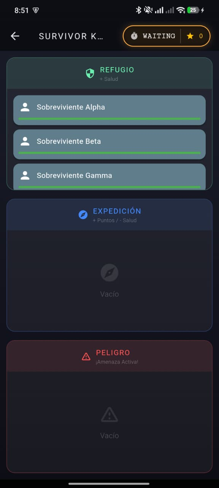
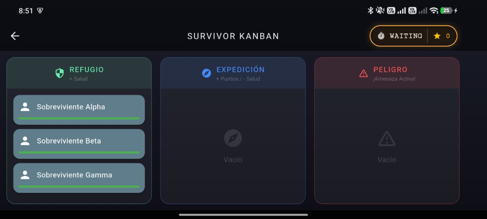

# Survivor Kanban: Tactical Rescue 🧟‍♂️📦

**Survivor Kanban** es un juego de estrategia y gestión de crisis desarrollado en **Dart y Flutter**. La aplicación utiliza la metáfora de un tablero Kanban para simular un entorno de supervivencia donde el jugador debe gestionar recursos y riesgos en tiempo real mediante mecánicas de arrastrar y soltar.

## 📸 Capturas de Pantalla

| Menú Principal | Gameplay (Vertical) | Gameplay (Horizontal) | Game Over |
|:---:|:---:|:---:|:---:|
|  |  |  |  |
| *Inicio de la misión* | *Vista táctica móvil* | *Vista de tablero completo* | *Fin de la misión* |

> *Nota: Las imágenes muestran la adaptación de la interfaz mediante `OrientationBuilder`.*

## 📂 Estructura del Proyecto

El proyecto está organizado siguiendo las mejores prácticas de Flutter, separando la lógica de los componentes visuales:

* `lib/models/`: Definición de los modelos de datos (`GameCard`, `GameState`).
* `lib/screens/`: Las tres pantallas principales de la aplicación:
    * `home_page.dart`: Menú de inicio.
    * `game_page.dart`: Núcleo del juego con el tablero dinámico.
    * `summary_page.dart`: Pantalla de estadísticas finales.
* `lib/widgets/`: Componentes reutilizables como la lógica de las columnas (`BoardColumn`) y las tarjetas interactivas (`SurvivorCard`).
* `lib/core/`: Estilos, colores y constantes globales.
* `screenshots/`: Imágenes demostrativas del funcionamiento de la app.
* `main.dart`: Punto de entrada y configuración de rutas.

## 🚀 Tecnologías y Widgets Utilizados

Para cumplir con los requisitos técnicos de la asignatura, se implementaron:

* **Interacción Táctica:** Uso de `Draggable` y `DragTarget` para la mecánica central de movimiento de cartas.
* **Diseño Responsivo:** Implementación de **`OrientationBuilder`** que adapta la interfaz en tiempo real:
    * **Modo Vertical:** Las columnas se organizan en un `Column` para facilitar el acceso rápido.
    * **Modo Horizontal:** Se utiliza un `Row` expandido para una visión panorámica táctica.
* **Motor de Juego (Game Loop):** Uso de `Timer.periodic` para gestionar la reducción de salud, la recuperación en el refugio y la aparición de eventos aleatorios cada segundo.
* **Gestión de Estados:** Uso de `StatefulWidget` para manejar la reactividad del tablero y la salud de las unidades.
* **Navegación:** Sistema de rutas nombrado con transferencia de argumentos para mostrar los resultados finales.

## 🎮 Mecánica de Juego

1.  **El Comienzo:** El tiempo está congelado al inicio. El motor del juego se activa únicamente cuando el jugador realiza su **primer movimiento**.
2.  **Gestión de Unidades:**
    * **Refugio (Shelter):** Las unidades recuperan salud lentamente.
    * **Expedición:** Las unidades generan "puntos de día" pero su salud disminuye por el esfuerzo.
3.  **Sistema de Peligro:** Aparecerán cartas de **Amenaza** (rojas) en la zona de Peligro. Mientras estén presentes, infligen daño global a todos los sobrevivientes. Debes mover a un sobreviviente a esa zona para eliminar la amenaza a cambio de una penalización de salud.
4.  **Recursos:** Aparecerán cartas de **Suministros** (verdes) que pueden ser consumidas en el Refugio para curaciones instantáneas.

## 🛠️ Instalación y Ejecución

1.  Asegúrate de tener instalado el SDK de Flutter.
2.  Clona este repositorio.
3.  Ejecuta `flutter pub get` en la terminal para descargar las dependencias.
4.  Lanza la aplicación con `flutter run`.
